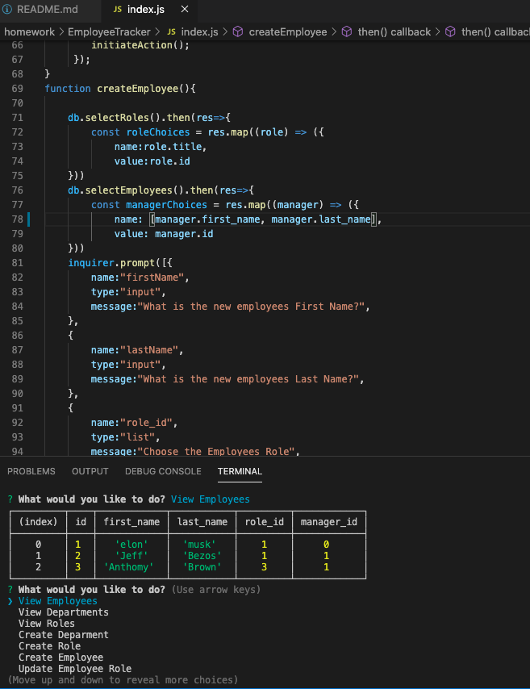

# Employee Tracker

  ## Description
    This project allows the user to view depratments, roles and employees, add departments, roles and employess and update employee roles. Roles are connected to specific departments and employees are connected to specific managers and roles. This projects uses a MySQL database and node for the user to be able to interact with it.
    Video walkthrough: https://drive.google.com/file/d/1nTE_Hz7gQ2hddXgOmpYSko8JNaYQL_ws/view

  ## Table of Contents

  *[Installation](#installation)

  *[Usage](#usage)

  *[Contributing](#contributing)

  *[Tests](#tests)

  *[Questions](#questions)

  ## Installation
  npm i will install all the dependencies

  ## Usage
  node index will start the application.

  ## Contributing
  contact me

  ## Tests
  There are no testing scripts for this application.

  ## Questions
  tbond4
  tristanebond@gmail.com